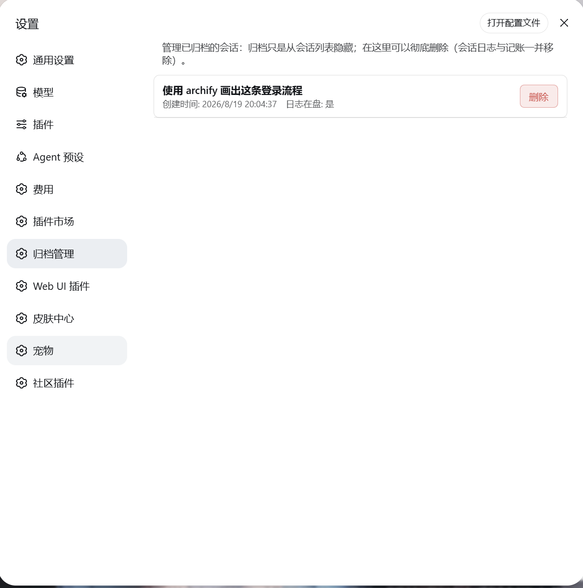

# dsh-archive-manager-plus

> Archive manager: list archived sessions in the Settings page and delete them for real (session log, archive marker, and projection cache removed together).

English | [中文](README.zh.md)

[](https://www.npmjs.com/package/dsh-archive-manager-plus)
[](https://github.com/MS666666/dsh-archive-manager)
[](LICENSE)



## Features

- Adds an **Archive Manager** tab to the Settings page (official `settings.section` slot — peers with General, Models, etc.)
- Lists all **archived sessions**: title, created time, and whether the log still exists on disk
- A **Delete** button on each row; a confirmation dialog, then a **real** delete
- Security-minded: same-origin POSTs only, strict session-id validation, Node self-verification after writes, automatic rollback on failure
- No UTF-8 BOM pitfalls across PowerShell editions (Windows PowerShell 5.1 and PowerShell 7 behave identically)

## Why

DSH's "archive session" only hides a session from the grouped views: the `session.jsonl.zstd` log and its accounting stay **untouched**, and the official UI has no delete entry. This plugin adds the "real delete" capability — archiving is only hiding; when you actually want the disk cleaned up, do it here.

## How it works

A dual-half plugin (the same shape as the official plugin ecosystem):

| Half | Location | Responsibility |
|---|---|---|
| host half | `lib/` | Mounts two HTTP routes: `GET /dsh-archive-manager-plus/list` lists archived sessions; `POST /dsh-archive-manager-plus/delete` deletes (session directory + workspace accounting + projection cache) |
| browser half | `client/` | Registers the `settings.section` page, renders the list + delete buttons (a `confirm` dialog first, then calls the host route) |

What a delete touches on disk:

1. Removes the id from `global.archivedSessionIds` in `workspace.json`
2. Removes the id from every workspace's `sessionIds`
3. Deletes `<DSH_HOME>/sessions/<workspace-encoded>/<session-id>/`
4. Clears the session entry in `session_projcache.json`

> The `cost-meter/ledger.json` is left alone (spend history is kept as a record).

## Install

### 1. npm (recommended, the community standard)

```powershell
npm install dsh-archive-manager-plus
```

This puts the package into your project/global `node_modules`; a DSH plugin must also be registered in a profile's bundle layer:

1. In `<profile>/package.json` → `dependencies`, add `"dsh-archive-manager-plus": "^0.1.0"`
2. In `dsh.profile.bundles`, append `"dsh-archive-manager-plus"`
3. Run `npm install` (or `pnpm install`), confirm the package landed in the profile, restart DSH and refresh the page

### 2. One-shot install script (local development)

```powershell
powershell -ExecutionPolicy Bypass -File .\install.ps1
```

The script resolves the plugin root from its own location (runnable from anywhere) and does: whitelist-copy the shipped files → register the dependency and bundle → Node self-verification (no BOM / valid JSON / entries complete) → rollback from backup on failure.

| Parameter | Description |
|---|---|
| `-ProfileDir <path>` | Explicit profile directory (highest priority) |
| `-ProfileName <name>` | Profile name, default `web` |
| `-DSHHome <path>` | DSH home (defaults to `$env:DSH_HOME`, then `~/.dsh`) |
| `-DryRun` | Preview only, write nothing |
| `-SkipCopy` | Skip the file copy; update the manifest only |

```powershell
.\install.ps1 -DryRun                    # preview
.\install.ps1 -DSHHome <your-dsh-home>   # point at a specific home
```

### 3. Manual

1. Copy `lib/`, `client/`, `cordis.patch.yml`, `LICENSE`, `README.md`, `package.json` to
   `<profile>/node_modules/dsh-archive-manager-plus/`
2. In `<profile>/package.json` → `dependencies`, add `"dsh-archive-manager-plus": "<version>"`
3. In `dsh.profile.bundles`, append `"dsh-archive-manager-plus"`
4. Save (UTF-8 **without BOM**), restart DSH and refresh the page

> ⚠️ BOM trap: a `package.json` with a UTF-8 BOM makes DSH fail to boot with `Unexpected token ''`.
> Prefer the npm install or the one-shot script (both write BOM-less UTF-8 and self-verify).

## Usage

1. In the sidebar, open any session row's `⋯` menu → **Archive session** (archive 1–2 sessions to try)
2. Open **Settings (gear) → Archive Manager**
3. The list shows archived sessions: title / created time / whether the log is on disk
4. Click **Delete** on a row → confirm → the row disappears and the disk log is removed

## Privacy & Security

- Deletion is limited to **archived sessions only**; never delete a session that is currently running (caller's responsibility)
- Deletion removes the disk log and associated accounting; **spend history is kept**
- In-memory host state (e.g. leftover `session.list` rows) may briefly remain visible until the next reconnect/refresh — the file and registry layers are always consistent and durable
- The gateway accepts same-origin requests only, and session ids pass a strict format whitelist (`session-` + hex/dashes), preventing path traversal
- All paths in this README are **placeholders** (`<DSH_HOME>`, `<profile>`…); do not paste machine paths, usernames, or session ids into issues/discussions

## Development

- Browser half is a hand-written CJS bundle (no build step): edit `client/client.js` and refresh the page (HMR picks it up)
- Host half is plain ESM: edit `lib/` and restart DSH
- After version bumps, re-run `install.ps1` to sync the manifest (no script edits needed)

### Publishing new versions (npm)

1. Bump `version` in `package.json` (follow [SemVer](https://semver.org/))
2. Verify locally: `node --check lib/*.js client/client.js` + `npm publish --dry-run`
3. Publish: `npm publish --registry=https://registry.npmjs.org/`
4. Create a matching GitHub release / tag (`v<version>`) to keep repository and npm in sync

## License

[MIT](LICENSE)